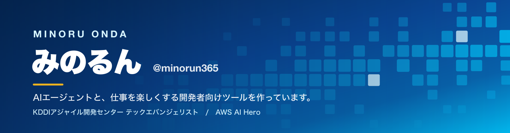

  
  

  
  
  
  

## アプリ

<table>
  <tr>
    <td width="50%" valign="top">
      <h3><a href="https://github.com/minorun365/marp-agent">パワポ作るマン</a></h3>
      
対話しながらスライドを自動生成するAIエージェント。

      
<a href="https://pawapo.minoruonda.com/">使ってみる</a> · <a href="https://github.com/minorun365/marp-agent">ソースコード</a>

      

    </td>
    <td width="50%" valign="top">
      <h3><a href="https://github.com/minorun365/html-share">HTML共有くん</a></h3>
      
Claude Codeが作ったHTMLを、スマホで確認・共有できるセルフホスト型ツール。

      
<a href="https://github.com/minorun365/html-share">ソースコード</a>

      

    </td>
  </tr>
  <tr>
    <td width="50%" valign="top">
      <h3><a href="https://github.com/minorun365/jirei-share-bot">事例共有くん</a></h3>
      
Slackの会話から取り組み事例を登録し、意味検索と定期共有を行うボット。

      
<a href="https://github.com/minorun365/jirei-share-bot">ソースコード</a>

      

    </td>
    <td width="50%" valign="top">
      <h3><a href="https://github.com/minorun365/live-dictation">文字起こしちゃん</a></h3>
      
会議音声をMac内で文字起こし・要約し、英語から日本語への翻訳にも対応するmacOSアプリ。

      
<a href="https://github.com/minorun365/live-dictation/releases/latest">ダウンロード</a> · <a href="https://github.com/minorun365/live-dictation">ソースコード</a>

      

    </td>
  </tr>
</table>

## 開発ツール

<table>
  <tr>
    <td width="50%" valign="top">
      <h3><a href="https://github.com/minorun365/my-claude-code-settings">Claude Code設定</a></h3>
      
ルール、スキル、フックを含む、普段使っているClaude Code設定の公開版。

      

    </td>
    <td width="50%" valign="top">
      <h3><a href="https://github.com/minorun365/agentcore-push">agentcore-push</a></h3>
      
1ファイルのStrands AgentをBedrock AgentCore Runtimeへデプロイするコマンドラインツール。

      

    </td>
  </tr>
</table>

## 著書

サンプルコードを公開している3冊です。

<table>
  <tr>
    <td width="33%" valign="top">
      <h3><a href="https://github.com/minorun365/agent-book">AIエージェント開発/運用入門</a></h3>
      
SBクリエイティブ · 2025年10月

      

    </td>
    <td width="33%" valign="top">
      <h3><a href="https://github.com/minorun365/bedrock-book">Amazon Bedrock 生成AIアプリ開発入門</a></h3>
      
SBクリエイティブ · 2024年6月

      

    </td>
    <td width="33%" valign="top">
      <h3><a href="https://github.com/minorun365/agentcore-book">Amazon Bedrock AgentCore実践入門</a></h3>
      
SBクリエイティブ · 2026年5月

      

    </td>
  </tr>
</table>

このほかに『やさしいMCP入門』（秀和システム）、『［入門］LLMアプリ開発』『MastraによるAIエージェント開発・運用［実践入門］』（技術評論社）があります。2026年9月には『［みのるん式］ビジネスパーソンのためのClaude Code仕事術』（技術評論社）が出ます。

## 認定・受賞

| | |
|---|---|
| **AWS AI Hero** | 2025年 · 日本初、全世界27名 |
| **AWS Community Hero** | 2024年 · 新任Hero 世界7名の1人 |
| **Japan AWS Top Engineers** | 2024・2025・2026年 · 3年連続 |
| **Qiita 年間TOP Contributor** | 2024・2025年 · 2年連続（5位・4位） |
| **Developers Summit 2026 ベストスピーカー1位** | 2026年 · Day2・Day3の部門1位 |
| **AWS Samurai** | 2023・2024年 · JAWS-UGのコミュニティ貢献表彰 |

[すべてのリポジトリを見る](https://github.com/minorun365?tab=repositories) · [プロフィール](https://minoruonda.com)

