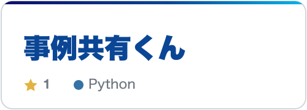
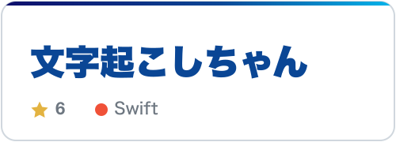
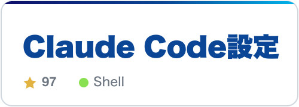
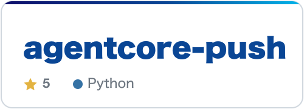
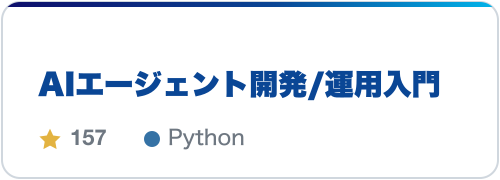
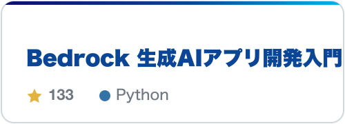
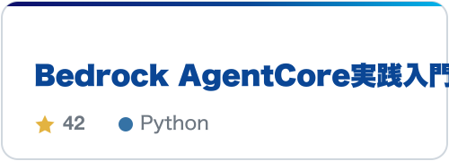

  
  
  
  

## アプリ

<table>
  <tr>
    <td width="50%" valign="top">
      <a href="https://github.com/minorun365/marp-agent">
        <picture>
          <source media="(prefers-color-scheme: dark)" srcset="./assets/cards/marp-agent-dark.png">
          
        </picture>
      </a>
      
対話しながらスライドを自動生成するAIエージェント。 <a href="https://pawapo.minoruonda.com/">使ってみる</a>

    </td>
    <td width="50%" valign="top">
      <a href="https://github.com/minorun365/html-share">
        <picture>
          <source media="(prefers-color-scheme: dark)" srcset="./assets/cards/html-share-dark.png">
          
        </picture>
      </a>
      
Claude Codeが作ったHTMLを、スマホで確認・共有できるセルフホスト型ツール。

    </td>
  </tr>
  <tr>
    <td width="50%" valign="top">
      <a href="https://github.com/minorun365/jirei-share-bot">
        <picture>
          <source media="(prefers-color-scheme: dark)" srcset="./assets/cards/jirei-share-bot-dark.png">
          
        </picture>
      </a>
      
Slackの会話から取り組み事例を登録し、意味検索と定期共有を行うボット。

    </td>
    <td width="50%" valign="top">
      <a href="https://github.com/minorun365/live-dictation">
        <picture>
          <source media="(prefers-color-scheme: dark)" srcset="./assets/cards/live-dictation-dark.png">
          
        </picture>
      </a>
      
会議音声をMac内で文字起こし・要約し、英語から日本語への翻訳にも対応するmacOSアプリ。 <a href="https://github.com/minorun365/live-dictation/releases/latest">ダウンロード</a>

    </td>
  </tr>
</table>

## 開発ツール

<table>
  <tr>
    <td width="50%" valign="top">
      <a href="https://github.com/minorun365/my-claude-code-settings">
        <picture>
          <source media="(prefers-color-scheme: dark)" srcset="./assets/cards/my-claude-code-settings-dark.png">
          
        </picture>
      </a>
      
ルール、スキル、フックを含む、普段使っているClaude Code設定の公開版。

    </td>
    <td width="50%" valign="top">
      <a href="https://github.com/minorun365/agentcore-push">
        <picture>
          <source media="(prefers-color-scheme: dark)" srcset="./assets/cards/agentcore-push-dark.png">
          
        </picture>
      </a>
      
1ファイルのStrands AgentをBedrock AgentCore Runtimeへデプロイするコマンドラインツール。

    </td>
  </tr>
</table>

## 著書

サンプルコードを公開している3冊です。

<table>
  <tr>
    <td width="50%" valign="top">
      <a href="https://github.com/minorun365/agent-book">
        <picture>
          <source media="(prefers-color-scheme: dark)" srcset="./assets/cards/agent-book-dark.png">
          
        </picture>
      </a>
      
SBクリエイティブ · 2025年10月

    </td>
    <td width="50%" valign="top">
      <a href="https://github.com/minorun365/bedrock-book">
        <picture>
          <source media="(prefers-color-scheme: dark)" srcset="./assets/cards/bedrock-book-dark.png">
          
        </picture>
      </a>
      
SBクリエイティブ · 2024年6月

    </td>
  </tr>
  <tr>
    <td width="50%" valign="top">
      <a href="https://github.com/minorun365/agentcore-book">
        <picture>
          <source media="(prefers-color-scheme: dark)" srcset="./assets/cards/agentcore-book-dark.png">
          
        </picture>
      </a>
      
SBクリエイティブ · 2026年5月

    </td>
    <td width="50%" valign="top"></td>
  </tr>
</table>

このほかに『やさしいMCP入門』（秀和システム）、『［入門］LLMアプリ開発』『MastraによるAIエージェント開発・運用［実践入門］』（技術評論社）があります。2026年9月には『［みのるん式］ビジネスパーソンのためのClaude Code仕事術』（技術評論社）が出ます。

## 認定・受賞

| 認定・受賞 | 年 | 補足 |
|---|---|---|
| AWS AI Hero | 2025 | 日本初、全世界27名 |
| AWS Community Hero | 2024 | 新任Hero 世界7名の1人 |
| Japan AWS Top Engineers | 2024・2025・2026 | 3年連続 |
| Qiita 年間TOP Contributor | 2024・2025 | 2年連続（5位・4位） |
| Developers Summit ベストスピーカー1位 | 2026 | Day2・Day3の部門1位 |
| AWS Samurai | 2023・2024 | JAWS-UGのコミュニティ貢献表彰 |

[すべてのリポジトリを見る](https://github.com/minorun365?tab=repositories) · [プロフィール](https://minoruonda.com)

