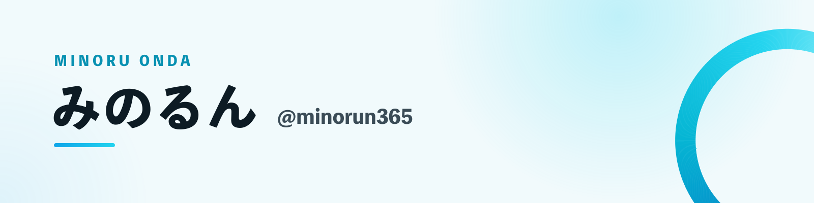
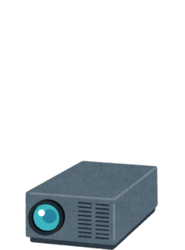
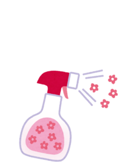
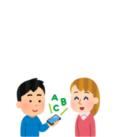
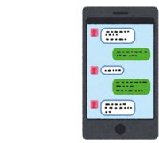
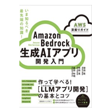

   
  
  
  
  

## ツール

<table>
  <tr>
    <td width="50%" valign="top">
      <h3><picture><source media="(max-width: 600px)" srcset="https://raw.githubusercontent.com/minorun365/minorun365/main/assets/cards/small/minorun-marp-skill.png" width="50" height="44"></picture><a href="https://github.com/minorun365/minorun-marp-skill">登壇スライド作成スキル</a></h3>
      
Marpで登壇スライドを作るときの、ストーリー・図・余白の型。黒地のテーマと、書き出したPDFを実測する検査ツールつき。

      
  

    </td>
    <td width="50%" valign="top">
      <h3><picture><source media="(max-width: 600px)" srcset="https://raw.githubusercontent.com/minorun365/minorun365/main/assets/cards/small/presenter.png" width="65" height="44"></picture><a href="https://github.com/minorun365/presenter">パワポ映すマン</a></h3>
      
Marpのスライドを、PowerPointの代わりに投影するスクリプト。残り時間を見ながら、もう1枚のディスプレイへ発表画面を出せる。

      
  

    </td>
  </tr>
  <tr>
    <td width="50%" valign="top">
      <h3><picture><source media="(max-width: 600px)" srcset="https://raw.githubusercontent.com/minorun365/minorun365/main/assets/cards/small/unslop-ai-app.png" width="47" height="44"></picture><a href="https://github.com/minorun365/unslop-ai-app">AI臭くないアプリ作成スキル</a></h3>
      
Webアプリの画面を「AIが作った感じ」にしないための規則と検査スクリプト。

      
  

    </td>
    <td width="50%" valign="top">
      <h3><picture><source media="(max-width: 600px)" srcset="https://raw.githubusercontent.com/minorun365/minorun365/main/assets/cards/small/claude-code-japanese-guard.png" width="42" height="44"></picture><a href="https://github.com/minorun365/claude-code-japanese-guard">日本語でおｋ</a></h3>
      
Claude Code の応答が英語に切り替わったら、日本語で書き直させる Stop hook。

      
  

    </td>
  </tr>
  <tr>
    <td width="50%" valign="top">
      <h3><picture><source media="(max-width: 600px)" srcset="https://raw.githubusercontent.com/minorun365/minorun365/main/assets/cards/small/agent-builder-skills.png" width="50" height="44"></picture><a href="https://github.com/minorun365/agent-builder-skills">AIエージェント開発スキル</a></h3>
      
AWSでAIエージェントのWebアプリを作るときに、公式どおりでも詰まる所をまとめたスキル集。AgentCore・Strands Agents・CDKに対応。

      
  

    </td>
    <td width="50%" valign="top">
      <h3><picture><source media="(max-width: 600px)" srcset="https://raw.githubusercontent.com/minorun365/minorun365/main/assets/cards/small/html-share.png" width="44" height="44"></picture><a href="https://github.com/minorun365/html-share">HTML共有く⁠ん</a></h3>
      
Claude Codeが作ったHTMLを、スマホで確認・共有できるセルフホスト型⁠ツ⁠ー⁠ル⁠。

      
  

    </td>
  </tr>
</table>

## アプリ

<table>
  <tr>
    <td width="50%" valign="top">
      <h3><picture><source media="(max-width: 600px)" srcset="https://raw.githubusercontent.com/minorun365/minorun365/main/assets/cards/small/handy-translator.png" width="62" height="44"></picture><a href="https://github.com/minorun365/handy-translator">通訳くん</a></h3>
      
英語の講演や会話をiPhone単体で聞き取り、日本語の字幕と直近5分の要約を出すiOSアプリ。

      
  

    </td>
    <td width="50%" valign="top">
      <h3><picture><source media="(max-width: 600px)" srcset="https://raw.githubusercontent.com/minorun365/minorun365/main/assets/cards/small/live-advisor.png" width="43" height="44"></picture><a href="https://github.com/minorun365/live-advisor">助言さん</a></h3>
      
文字起こしちゃんの書き起こしを読み、会議中に調査結果と議論の進め方の提案をメニューバーに出すmacOSアプリ。

      
  

    </td>
  </tr>
  <tr>
    <td width="50%" valign="top">
      <h3><picture><source media="(max-width: 600px)" srcset="https://raw.githubusercontent.com/minorun365/minorun365/main/assets/cards/small/minorun-agent.png" width="24" height="44"></picture><a href="https://github.com/minorun365/minorun-agent">みのるんエージェント</a></h3>
      
AWS re:Invent 2026に日本から参加する人の質問に、日本語で答えるAIエージェント。

      
  

    </td>
    <td width="50%" valign="top">
      <h3><picture><source media="(max-width: 600px)" srcset="https://raw.githubusercontent.com/minorun365/minorun365/main/assets/cards/small/sleep-toggle-menu.png" width="40" height="44"></picture><a href="https://github.com/minorun365/sleep-toggle-menu">スリープ切替メニュー</a></h3>
      
MacBookがスリープするかどうかをメニューバーから切り替えるmacOSアプリ。蓋を閉じても処理を続けられる。

      
  

    </td>
  </tr>
  <tr>
    <td width="50%" valign="top">
      <h3><picture><source media="(max-width: 600px)" srcset="https://raw.githubusercontent.com/minorun365/minorun365/main/assets/cards/small/live-dictation.png" width="44" height="44"></picture><a href="https://github.com/minorun365/live-dictation">文字起こしちゃん</a></h3>
      
会議の音声をMac内で文字起こし・要約し、英語から日本語への翻訳にも対応するmacOSアプリ。

      
  

    </td>
    <td width="50%" valign="top">
      <h3><picture><source media="(max-width: 600px)" srcset="https://raw.githubusercontent.com/minorun365/minorun365/main/assets/cards/small/agentcore-line-chatbot.png" width="25" height="44"></picture><a href="https://github.com/minorun365/agentcore-line-chatbot">LINE AIエージェント</a></h3>
      
LINEで動くAIチャットボット。ツール実行中の途中経過も吹き出しで流れる。

      
  

    </td>
  </tr>
</table>

## 著書

サンプルコードを公開している3冊です。

<table>
  <tr>
    <td width="50%" valign="top">
      <h3><picture><source media="(max-width: 600px)" srcset="https://raw.githubusercontent.com/minorun365/minorun365/main/assets/cards/small/agentcore-book.png" width="31" height="44"></picture><a href="https://github.com/minorun365/agentcore-book">Amazon Bedrock AgentCore実⁠践⁠入⁠門</a></h3>
      
SBクリエイティブ · 2026年5月

      
  

    </td>
    <td width="50%" valign="top">
      <h3><picture><source media="(max-width: 600px)" srcset="https://raw.githubusercontent.com/minorun365/minorun365/main/assets/cards/small/agent-book.png" width="31" height="44"></picture><a href="https://github.com/minorun365/agent-book">AIエージェント開発/運⁠用⁠入⁠門</a></h3>
      
SBクリエイティブ · 2025年10月

      
  

    </td>
  </tr>
  <tr>
    <td width="50%" valign="top">
      <h3><picture><source media="(max-width: 600px)" srcset="https://raw.githubusercontent.com/minorun365/minorun365/main/assets/cards/small/bedrock-book.png" width="31" height="44"></picture><a href="https://github.com/minorun365/bedrock-book">Amazon Bedrock 生成AIアプリ開⁠発⁠入⁠門</a></h3>
      
SBクリエイティブ · 2024年6月

      
  

    </td>
    <td width="50%" valign="top">
      
 このほかに『［みのるん式］ビジネスパーソンのためのClaude Code仕事術』『［入門］LLMアプリ開発』『MastraによるAIエージェント開発・運用［実践入門］』（技術評論社）、『やさしいMCP入門』（秀和システム）があります。

    </td>
  </tr>
</table>

## 認定・受賞

| 認定・受賞 | 年 | 補足 |
|---|---|---|
| Developers Summit ベストスピーカー1位 | 2026 | Day2・Day3の部門1位 |
| Japan AWS Top Engineers | 2024・2025・2026 | 3年連続 |
| ITエンジニア本大賞 技術書部門 ベスト10 | 2025・2026 | 2年連続 |
| AWS AI Hero | 2025 | 日本初、全世界27名 |
| Qiita 年間TOP Contributor | 2024・2025 | 2年連続（5位・4位） |
| AWS Community Hero | 2024 | 新任Hero 世界7名の1人 |
| AWS Samurai | 2023・2024 | JAWS-UGのコミュニティ貢献表彰 |

[すべてのリポジトリを見る](https://github.com/minorun365?tab=repositories) · [プロフィール](https://minoruonda.com)

